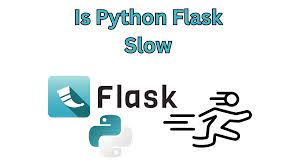

[Link Top de Pesquisa de Markdown](https://www.markdownguide.org/basic-syntax/#headings)
[Link da Documentação do Flask](https://flask-ptbr.readthedocs.io/en/latest/)

[Youtube Thi Code PlayList Flask Bootstrap](https://www.youtube.com/watch?v=pzsBEuiZ2I4&list=PLR8JXremim5DU70e3x_rYhClgMTzTyv4m&index=1)

> Estruturando Pastas e Arquivos iniciais de um Projeto MVC com Flask

[Youtube Júlia Rizo PlayList Flask ](https://www.youtube.com/watch?v=0iHsyTkyoXo&list=PL3BqW_m3m6a05ALSBW02qDXmfDKIip2KX&index=3)

<b>O que é Flask?</b> É um micro framework. Pense em um Micro-Framework como uma peça de lego. Inicialmente, um projeto criado com o micro-framework possui apenas o básico para funcionar, (normalmente, sistema de rotas), porém, ao decorrer do projeto, podem haver necessidades para utilização de outros recursos como, conexão de banco de dados, sistemas de templates, envio de email, etc. A partir desta necessidade, novas bibliotecas são “encaixadas” no projeto, como uma estrutura de lego.

 Lançado em 2010 e desenvolvido por Armin Ronacher, o Flask é um micro-framework destinado principalmente a pequenas aplicações com requisitos mais simples, como por exemplo, a criação de um site básico.
 

 

 <b>Dica Importante:</b>
 Para criar um projeto MVC inicial com Flask, seguimos a dica da tecnóloga Julia Rizzo como descrito no link conforme disposto na parte superior do REDEAME.md, composto com 07(sete) passos que foram escritor em linguagem shell script conforme detalhamento logo abaixo diposto:
  
  <b>PRIMEIRO PASSO:</b>
  <i>
    Iremos executar o arquivo <strong>1_criando_ambiente_virtual.sh</strong> -> reponsável por configurar e criar o ambiente virtual python do projeto.
  </i>
   
  <b>SEGUNDO PASSO:</b>
  <i>
    Iremos executar o arquivo <strong>2_instalando_git_no_projeto.sh</strong> -> reponsável por fazer o controle de versionamento da aplicação de forma local e na núvem (github).
  </i>
 <b>TERCEIRO PASSO:</b>
  <i>
    Iremos executar o arquivo <strong>3_instalando_flask.sh</strong> -> reponsável por fazer a instalação do microframework na pasta do projeto dentro do ambiente virtual setado.
  </i>

  <b>QUARTO PASSO:</b>
  <i>
    Iremos executar o arquivo <strong>4_salvando_dependências.sh</strong> -> reponsável por salvar todas libs do projeto dentro de uma arquivo txt chamado <strong>requeriments.txt</strong>.
  </i>

  <b>QUINTO PASSO:</b>
  <i>
    Iremos executar o arquivo <strong>5_run_server.sh</strong> -> reponsável executar o servidor  (localhost) do flask onde iremos desenvolver a aplicação antes de hospedar na núvem.  </i>

  <b>SEXTO PASSO:</b>
  <i>
    Iremos executar o arquivo <strong>6_limpando_port_5000.sh</strong> -> reponsável caso a aplicação esteja rodando em portas diferentes podemos stopar e iniciar a aplicação novamente.  </i>
 
  <b>SÉTIMO PASSO:</b>
  <i>
    Iremos executar o arquivo <strong>7_initiall_aplication_flask.sh</strong> -> reponsável por criar a estrutura MVC (grupo de pastas e sub-pastas iniciais do projeto), e criar e escrever arquivos iniciais de configuração do projeto e roda o projeto inicial hellow world.  </i>   

 
