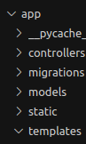
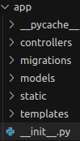
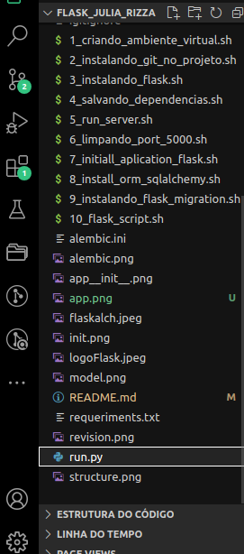
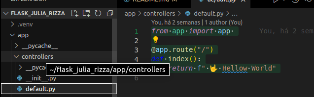
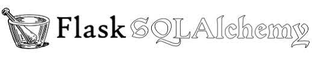
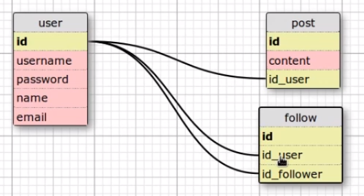
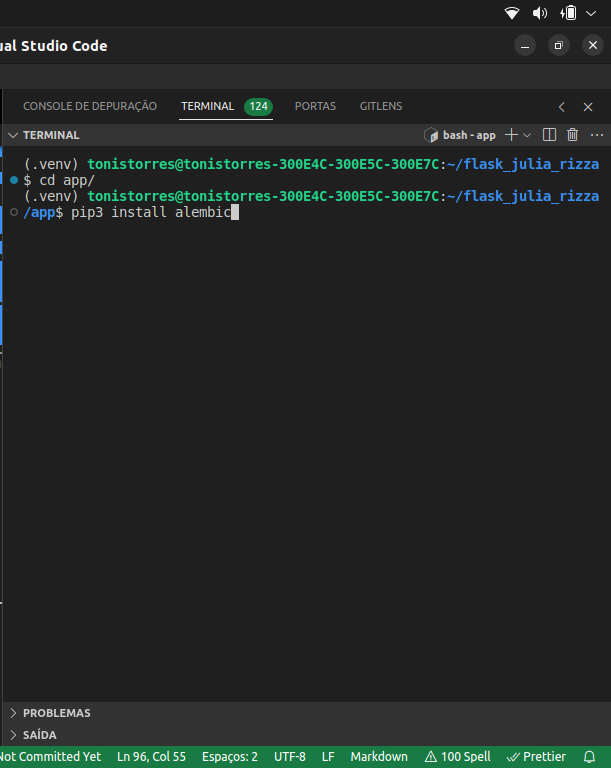
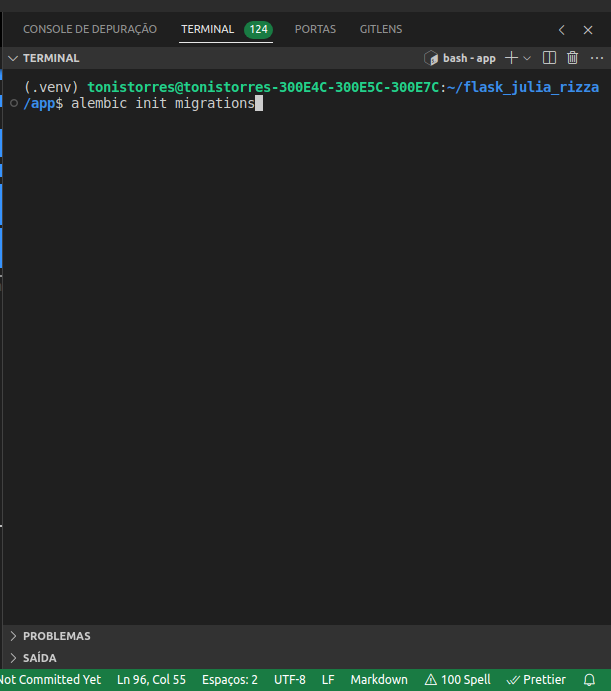
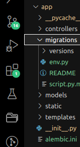
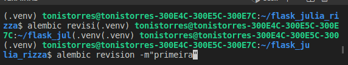

[Link Top de Pesquisa de Markdown](https://www.markdownguide.org/basic-syntax/#headings)
[Link da Documentação do Flask](https://flask-ptbr.readthedocs.io/en/latest/)

[Youtube Thi Code PlayList Flask Bootstrap](https://www.youtube.com/watch?v=pzsBEuiZ2I4&list=PLR8JXremim5DU70e3x_rYhClgMTzTyv4m&index=1)

> Estruturando Pastas e Arquivos iniciais de um Projeto MVC com Flask

[Youtube Júlia Rizo PlayList Flask ](https://www.youtube.com/watch?v=0iHsyTkyoXo&list=PL3BqW_m3m6a05ALSBW02qDXmfDKIip2KX&index=3)


<p>
<b>O que é Flask?</b> É um micro framework. Pense em um Micro-Framework como uma peça de lego. Inicialmente, um projeto criado com o micro-framework possui apenas o básico para funcionar, (normalmente, sistema de rotas), porém, ao decorrer do projeto, podem haver necessidades para utilização de outros recursos como, conexão de banco de dados, sistemas de templates, envio de email, etc. A partir desta necessidade, novas bibliotecas são “encaixadas” no projeto, como uma estrutura de lego.
</p>

<p>
 Lançado em 2010 e desenvolvido por Armin Ronacher, o Flask é um micro-framework destinado principalmente a pequenas aplicações com requisitos mais simples, como por exemplo, a criação de um site básico.
 </p>

 <p>
 <b>Dica Importante:</b>
 Para criar um projeto MVC inicial com Flask, seguimos a dica da tecnóloga Julia Rizzo como descrito no link conforme disposto na parte superior do REDEAME.md, composto com 07(sete) passos que foram escritor em linguagem shell script conforme detalhamento logo abaixo diposto:
 <br>
  <b>PRIMEIRO PASSO:</b>
  <i>
    Iremos executar o arquivo <strong>1_criando_ambiente_virtual.sh</strong> -> reponsável por configurar e criar o ambiente virtual python do projeto.
  </i>
  <br>
  <b>SEGUNDO PASSO:</b>
  <i>
    Iremos executar o arquivo <strong>2_instalando_git_no_projeto.sh</strong> -> reponsável por fazer o controle de versionamento da aplicação de forma local e na núvem (github).
  </i>
 <b>TERCEIRO PASSO:</b>
  <i>
    Iremos executar o arquivo <strong>3_instalando_flask.sh</strong> -> reponsável por fazer a instalação do microframework na pasta do projeto dentro do ambiente virtual setado.
  </i>

  <b>QUARTO PASSO:</b>
  <i>
    Iremos executar o arquivo <strong>4_salvando_dependências.sh</strong> -> reponsável por salvar todas libs do projeto dentro de uma arquivo txt chamado <strong>requeriments.txt</strong>.
  </i>

  <b>QUINTO PASSO:</b>
  <i>
    Iremos executar o arquivo <strong>5_run_server.sh</strong> -> reponsável executar o servidor  (localhost) do flask onde iremos desenvolver a aplicação antes de hospedar na núvem.  </i>


  <b>SEXTO PASSO:</b>
  <i>
    Iremos executar o arquivo <strong>6_limpando_port_5000.sh</strong> -> reponsável caso a aplicação esteja rodando em portas diferentes podemos stopar e iniciar a aplicação novamente.  </i>
 
  <b>SÉTIMO PASSO:</b>
  <i>
    Iremos executar o arquivo <strong>7_initiall_aplication_flask.sh</strong> -> reponsável por criar a estrutura MVC (grupo de pastas e sub-pastas iniciais do projeto), e criar e escrever arquivos iniciais de configuração do projeto e roda o projeto inicial hellow world.  </i>   

 </p>

[Vídeo Exemplo Organizando aplicação no modelo MVC](https://www.youtube.com/watch?v=0iHsyTkyoXo&list=PL3BqW_m3m6a05ALSBW02qDXmfDKIip2KX&index=3)

<h4>Organizando a aplicação no modelo MVC</h4>
<p> 

* 1º vamos criar a pasta principal a nomearei de <strong><i>app</i></strong><br>

* 2º Dentro da pasta principal <strong>app</strong>, iremos criar as seguintes sub-pastas:<br>
    
    * models - iremos tercerizar essa camada para orm sqlalchemy;
    * controllers - onde ficará a lógica da aplicação;
    * static - onde ficarão os arquivos estáticos (css) ...
    * tempaltes - onde ficarão os arquivos html.
 <p>

 <p>
 <b>Observação 1:</b> No flask temos um padrão que toda pasta contendo arquivo html se chamam <strong>templates</strong> e a pasta que contém arquivos estáticos<b>(css)</b> se chama <strong>static</strong>
 </p>


<h4>Ilustração:</h4>

 

<p>
<b>Observação 2:</b> dentro da pasta principal <strong>app</strong> criaremos um arquivo com o nome <strong>__init__.py</strong> utilizamos esse procedimento de criar esse arquivo quando iremos treabalhar com módulos dentro do python. O  <strong>__init__.py</strong> aqui explicitádo está indicando que a pasta <b>app</b>
 é o módulo principal e que no futuro teremos sub-módulos dentro da pasta  <strong>app</strong> onde cda uma das pastas terão  <strong>__init__.py</strong> com exceção da pasta <i>templates e static</i>
</p>

<p>
 O <strong>__init__.py</strong> <b><i>principal</i></b> que está dentro da pasta <b><i>app</i></b> conterá as configurações principais do flask.
</p>


<h4>Ilustração arquivo <strong>__init__.py da pasta app</strong>:</h4>



 ```py
 
from flask import Flask


app = Flask(__name__)

# importando o módulo controllers para o módulo  
# principal de execução
from app.controllers import default
 ```


<p>
<b>Observação 3:</b> No arquivo <strong>run.py</strong>
ficará a lógica para iniciar a execução da aplicação.
<p>





```py
# Neste arquivo ficará a lógica para startar
# a aplicação

from app import app


if __name__ =="__main__":
    app.run()


```
<p>Observação 4: a camada de <b>controllers</b> será conterá os arquivos de lógica da aplicação, como exemplo inicial temos o arquivos (__init__.py) indicando que é um sub-módulo de <b>app</b> dentro do python e temos o arquivo (default.py) com um exemplo de hello word na rota index da aplicação. </p>


```py
from app import app 

@app.route("/")
def index():
    return f" 🤟 Hellow World"

```


[Youtube Júlia Rizo Falsk SQlAlchemy ](https://www.youtube.com/watch?v=R3nS66dgo2w&list=PL3BqW_m3m6a05ALSBW02qDXmfDKIip2KX&index=4)
 
 
 
 <p>
 <strong>O que é Flask SqlAlchemy?</strong><i> É um ORM completo, criado com Python para desenvolvedores de aplicativos, que fornece flexibilidade total do SQL, obtendo um conjunto completo de padrões de persistência de nível corporativo bem conhecidos, que são projetados para acesso a banco de dados eficientes e de alto desempenho.</i>
 </p>

 <p><strong>Instalação:</strong>
 </br>
  <i>Já setado no ambiente virtual do módulo python a ser trabalhado, digite o seguinte comando:</i> <strong>pip3 install flask-sqlalchemy</strong>
 
 </p>

 <p>
  <strong>
    Modelo do Banco de Dados a ser Trabalhado no Projeto:
  <strong>
  </br>

  

 </p>

[DOCUMENTAR DEPOIS A PARITR 23 min : 56 seg ](https://www.youtube.com/watch?v=yQtqkq9UkDA&t=14s)


<h1>O que é o Alembic?</h1>

<p>
O <strong>Alembic</strong> foi inicialmente desenvolvido por Mike Bayers, mesmo criador do SQLAlchemy. Teve sua primeira versão lançada em novembro de 2011. 5 anos após a primeira versão do SQLAlchemy, em 2006.
</br>
 * Pode trabalhar em toda a camada DDL;
</br>
* Fornece scripts de migração de schemas para upgrades e downgrades;
</br>
*Suporte a geração de SQL (offline);
</br>
* API minimalista.
</p>

<p><strong>Instalação:<strong></p>




<p><strong>Execução:</strong></p>

<p>
Entre na pasta do projeto, em nosso caso o diretório(app) e execute o comando abaixo conforme ilustração:
<p>



<p>Estrutura Criada no Projeto pelo comando<strong><i>alembic init migrations </i></strong></p>



<h3>Arquivos Importante Criados Juntos a Estrutura de Pastas:</h3>


<p>
<strong>* alembic.init</strong></br>
<i>O script escrito no alembic.init é uma arquivo criado de forma automática, portanto, genérico que consiste numa configuração para um único banco de Dados.</i>
</p>

<h4>Exemplificando: Gerando a primeira migração:</h4>
-  Comando que criar um versionamento na pasta <i>migrations</i> conforme configurações aqui explicitada logo no readme.mb acima.




<h4>Corpo do Script (conteúdo do versionamento):</h4>

```
"""primeira

Revision ID: 41244e6b200b
Revises: 
Create Date: 2023-11-04 08:51:40.598200

"""
from typing import Sequence, Union

# Api de operações DDL 
from alembic import op


import sqlalchemy as sa


# revision identifiers, used by Alembic.
revision: str = '41244e6b200b'
down_revision: Union[str, None] = None
branch_labels: Union[str, Sequence[str], None] = None
depends_on: Union[str, Sequence[str], None] = None

# (Explicação Youtube em 37 min)[https://www.youtube.com/watch?v=yQtqkq9UkDA&t=14s]

# upgrade -> é a função que aplica a migração, ou seja, como é que essa migração será aplicada de fato.
# Exemplo: Quero criar uma tabela, quero modificar ... 
def upgrade() -> None:
    pass

# downgrade -> quero excluir uma tabela, remover a coluna 
def downgrade() -> None:
    pass


```

[Documentação SqlAlchemy Core](https://docs.sqlalchemy.org/en/20/core/)

<h4>SqlAlchemy Core:</h4>
<p>Os tipos de dados e as abstrações necessárias para executar a API de operações estão no SQL Alchemy Core</p>
